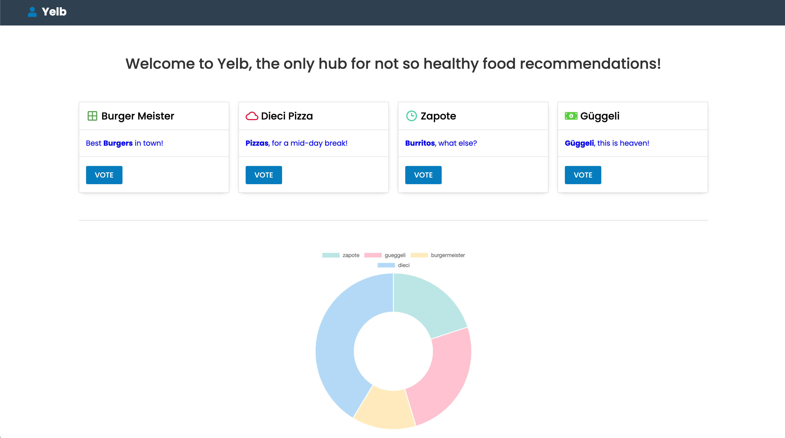
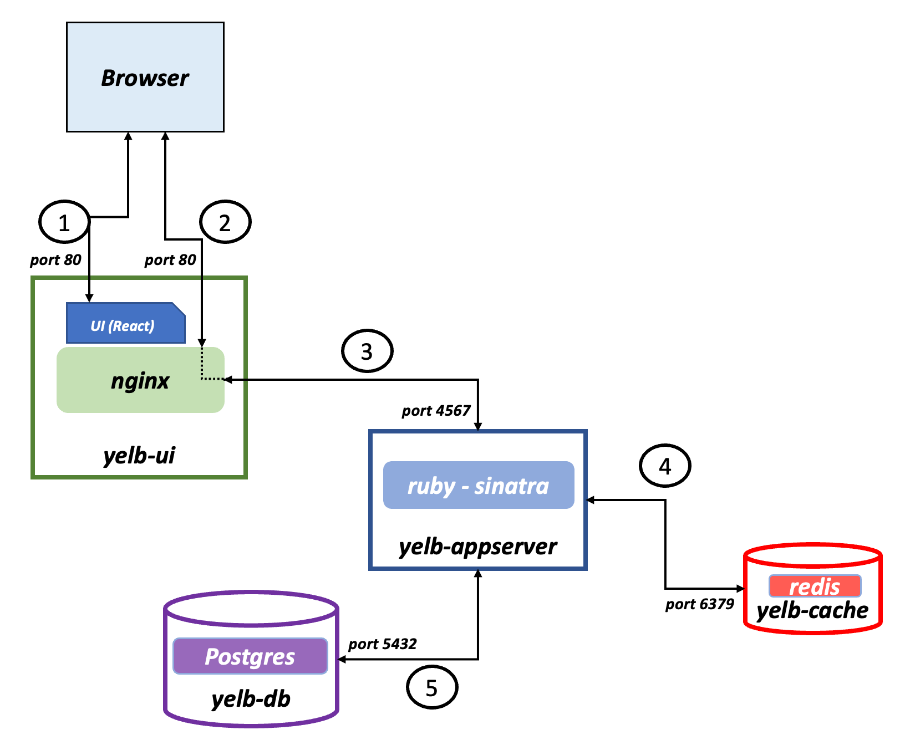

#  - 


<h1 align="center">Kubernetes Deployment of Yelb Application</h1>
<h3 align="center"> Cloud & Containerization course at the University of Applied Sciences Northwestern (FHNW)</h3>
<h3 align="center">Claudio Schmidli</h3>
<h4 align="center">30.06.2023</h4>

## Project Overview
This repository contains the final project work for the Cloud & Containerization course at the University of Applied Sciences Northwestern Switzerland (FHNW), completed on November 22, 2024 by Claudio Schmidli.

The project demonstrates the deployment of a multi-tier web application (Yelb) on Kubernetes, including:
- Kubernetes manifest files for manual deployment
- Helm charts for automated and reproducible deployment
- Integration with cloud services (DigitalOcean Kubernetes)
- Container image management and deployment workflows

## Application Architecture

Yelb is a three-tier demo application with the following user interface:



The application consists of four main components:
- Yelb UI (React frontend)
- Yelb Appserver (Ruby on Rails backend)
- Database (Postgres)
- Cache (Redis)

The architecture diagram shows how these components interact:



## Deployment Instructions

### Using Kubernetes Manifests
The application can be deployed directly using the Kubernetes manifests located in the `k8_yaml` directory.

1. Create the required secrets for image pulling:
```bash
kubectl create secret docker-registry your-image-registry \
 --docker-server=cr.gitlab.fhnw.ch \
 --docker-username=<gitlab-username> \
 --docker-password=<gitlab-token> \
 --docker-email=<gitlab-user-email>
```

2. Deploy the application stack:
```bash
kubectl apply -f k8_yaml/template-yelb-k8s-app-stack.yaml
```

3. Verify the deployment:
```bash
# Check Pod status
kubectl get pods

# Check Deployments
kubectl get deploy

# Check Services
kubectl describe svc <service-name>
```

4. To remove the deployment:
```bash
kubectl delete -f k8_yaml/template-yelb-k8s-app-stack.yaml
```

### Using Helm Chart
For a more automated deployment, use the Helm chart located in the `chart` directory.

1. Ensure the image pull secret exists (see step 1 above if not)

2. Test the Helm chart rendering:
```bash
helm template yelb . -f values.yaml
```

3. Install the chart:
```bash
helm upgrade -i yelb . \
  -n <namespace> \
  -f values.yaml
```

The application will be accessible via the configured Ingress URL with automatic TLS certificate provisioning through cert-manager.
